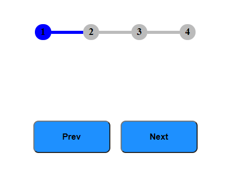

## Progress step using Html,CSS and JS

### What will you learn??
 - Basic problem solving approach
 - Transition
 - class toggling
 - Basic JS object creation
 - Event Handling
 - FlexBox

ScreenShot:


 ```
    What I learned is never give up.Practice ,Practice and Practice.It makes you more confidence.
 ```